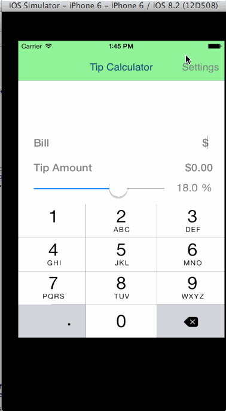

# TipCalculator

This is an Andriod application for tip calculation based on input bill amount and selected tip percentage.

Time Spent: 6 hours in total. 

Completed use stories:

  * [x] Required: Adding Tip Calculator Setting Page for setting default tip amount. 
  * [x] Optional: Use locale for specific currency.
  * [x] Optional: Remember the bill amount across app restart.
  * [x] Optional: Light Dark theme. 
  * [x] Additional: Added slider bar instead of segment control.
  * [x] Additional: Take "# of people" and computes individual amount. 

Notes:

Walkthrough of all use stories:

GIF created with [LiceCap](http://www.cockos.com/licecap/).
